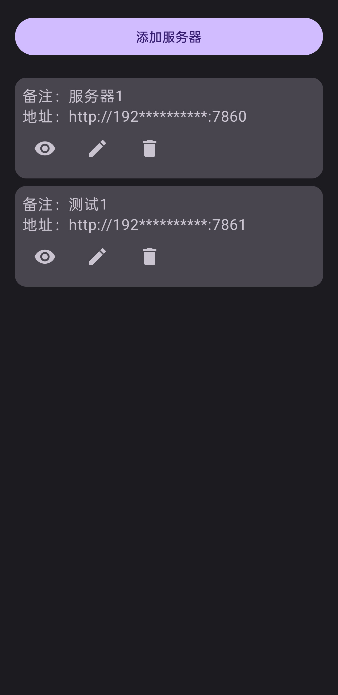
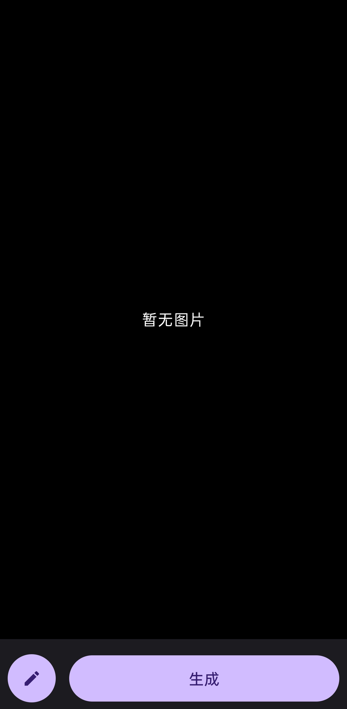
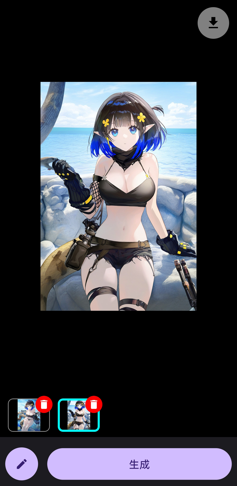
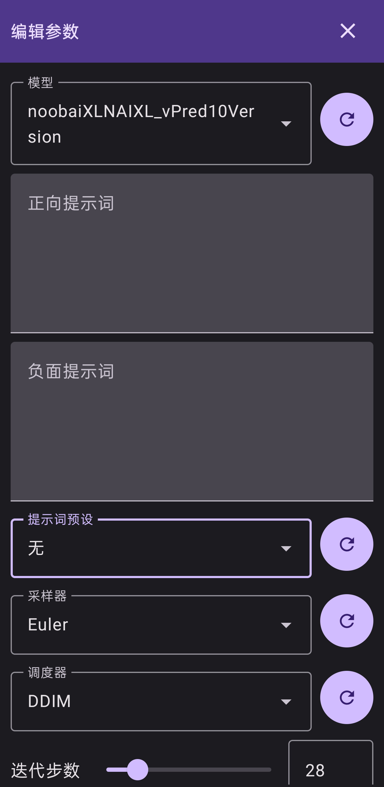
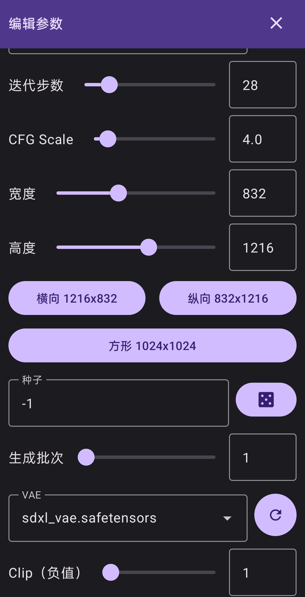
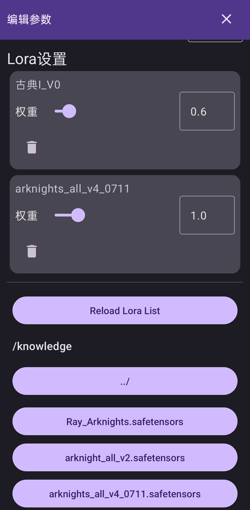

# Stable Diffusion Android Client

A standalone Android client for interacting with [AUTOMATIC1111/stable-diffusion-webui](https://github.com/AUTOMATIC1111/stable-diffusion-webui) via its API.

Please make sure to launch the web UI with the `--listen --api` flag enabled.

#### Features

- [x] Automatically saves generation parameters to avoid re-entering them each time
- [x] Multilingual UI:
  - [x] English - English
  - [x] 简体中文 - Simplified Chinese
  - [x] 繁體中文（台灣）- Traditional Chinese (Taiwan)
  - [x] 繁體中文（香港）- Traditional Chinese (Hong Kong)
  - [x] 日本語 - Japanese
  - [x] 한국어 - Korean
- [ ] Image-to-Image support
- [ ] ControlNet integration
- [ ] Light theme color scheme fix
- [ ] Import/export configuration files
- [ ] Create and edit prompt styles
- [ ] One-tap result sharing
- [ ] Parameter preset management (save and switch between multiple configurations)
- [ ] Settings panel:
  - [ ] Automatically save generated images
  - [ ] Language selection
  - [ ] Light/dark mode toggle

💬 Feel free to open an issue or submit a pull request!

---

一个独立的 Android 客户端，可通过 API 与 [AUTOMATIC1111/stable-diffusion-webui](https://github.com/AUTOMATIC1111/stable-diffusion-webui) 通信。

请确保在启动 WebUI 时添加 `--listen --api` 参数。

#### 功能特性

- [x] 自动保存生成参数等数据，无需每次重新输入
- [x] 多语言界面：
  - [x] English - 英文
  - [x] 简体中文 - 简体中文
  - [x] 繁體中文（台灣）- 繁体中文（台湾）
  - [x] 繁體中文（香港）- 繁体中文（香港）
  - [x] 日本語 - 日文
  - [x] 한국어 - 韩文
- [ ] 图生图模式支持
- [ ] ControlNet 支持
- [ ] 明亮主题配色修复
- [ ] 配置文件导入导出
- [ ] 新建/编辑提示词预设
- [ ] 生成结果一键分享
- [ ] 参数预设管理（保存多个配置并切换）
- [ ] 设置面板
  - [ ] 自动保存生成结果
  - [ ] 语言
  - [ ] 明亮/黑暗模式切换

💬 欢迎提交 Issue 或 Pull Request！

---

### 软件截图

### Software Screenshots

