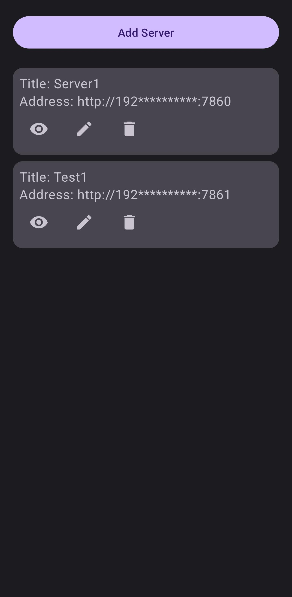
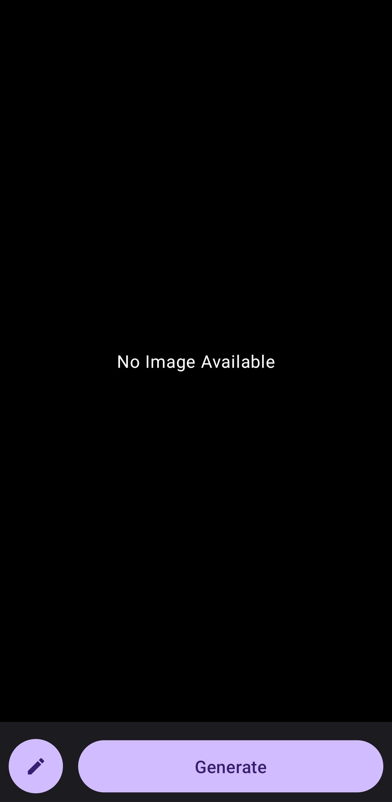
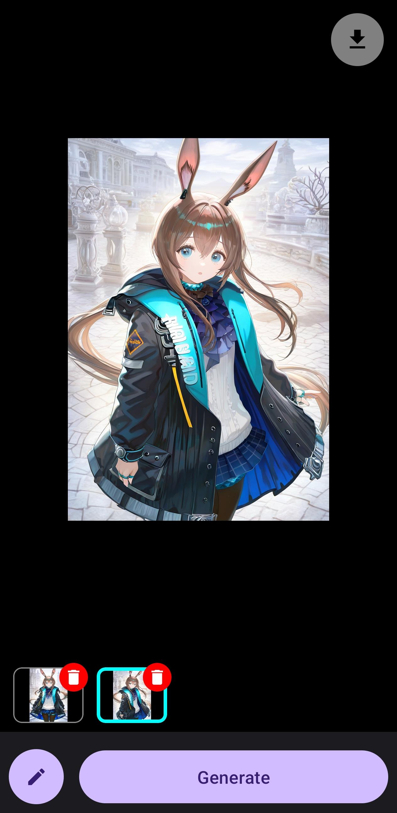
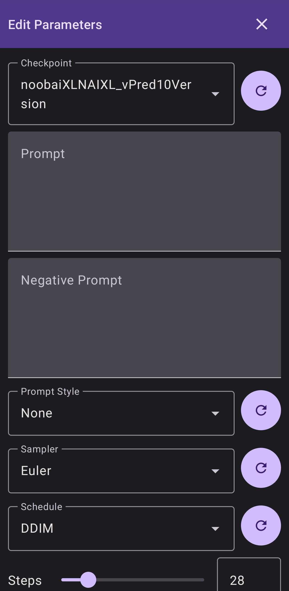
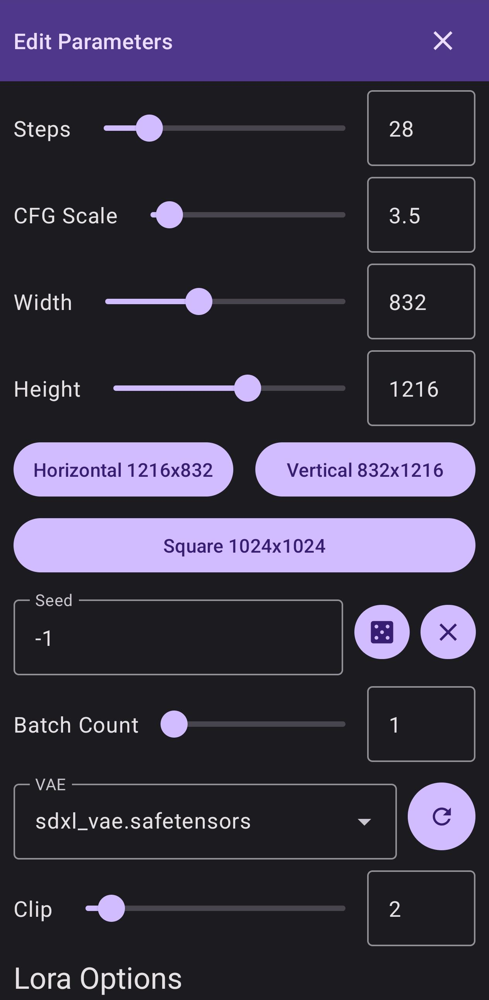
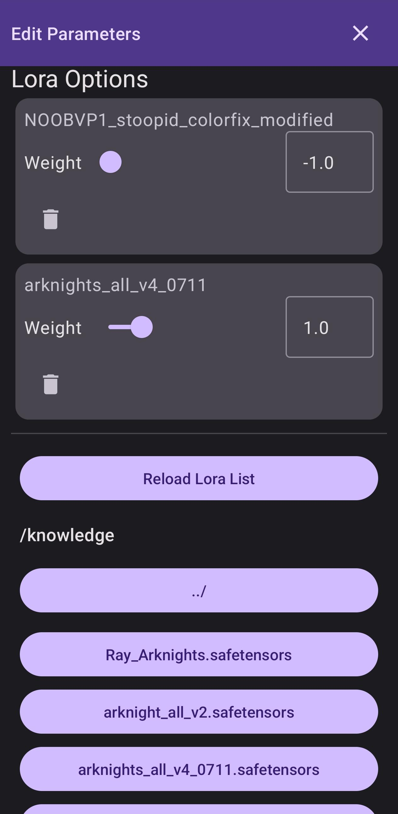

  
  <h2 align="center">Stable Diffusion Android Client</h2>
  
Android client for controlling AUTOMATIC1111's Stable Diffusion WebUI.

  
  
  

  

    <a href="./README.md">English</a>
    ·
    <a href="./README.zh-CN.md">简体中文</a>
  

## Overview

A standalone Android client for interacting with [AUTOMATIC1111/stable-diffusion-webui](https://github.com/AUTOMATIC1111/stable-diffusion-webui) via its API.

Please make sure to launch the web UI with the `--listen --api` flag enabled.

#### Features

- [x] Automatically saves generation parameters to avoid re-entering them each time
- [x] Multilingual UI:
  - [x] English - English
  - [x] 简体中文 - Simplified Chinese
  - [x] 繁體中文（台灣）- Traditional Chinese (Taiwan)
  - [x] 繁體中文（香港）- Traditional Chinese (Hong Kong)
  - [x] 日本語 - Japanese
  - [x] 한국어 - Korean
- [ ] Image-to-Image support
- [ ] ControlNet integration
- [ ] Light theme color scheme fix
- [ ] Import/export configuration files
- [ ] Create and edit prompt styles
- [ ] One-tap result sharing
- [ ] Parameter preset management (save and switch between multiple configurations)
- [ ] Settings panel:
  - [ ] Automatically save generated images
  - [ ] Language selection
  - [ ] Light/dark mode toggle

💬 Feel free to open an issue or submit a pull request!

### Software Screenshots

