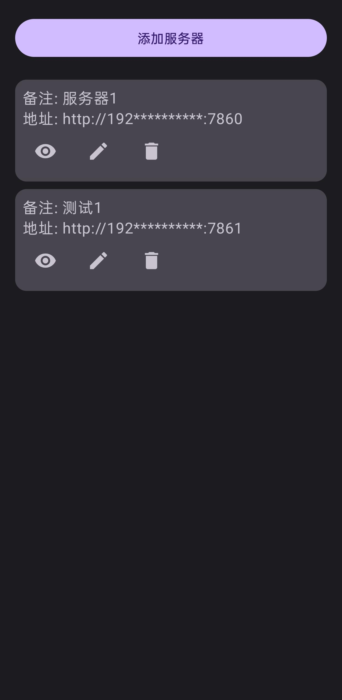
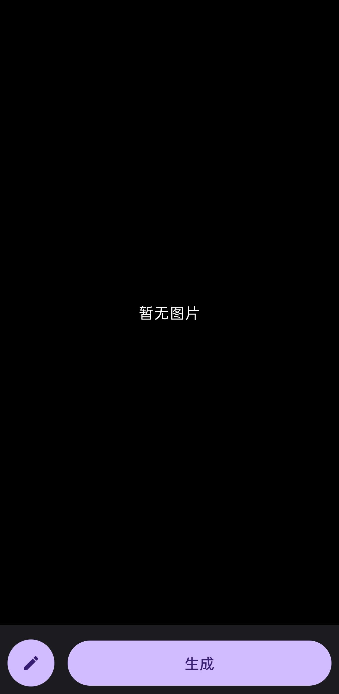
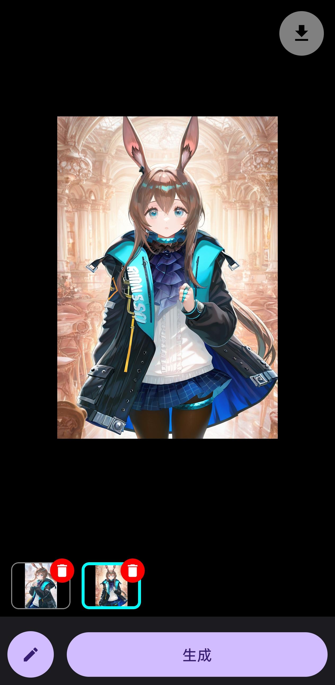
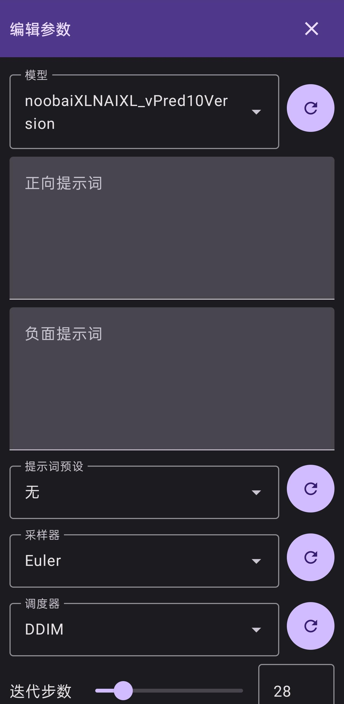
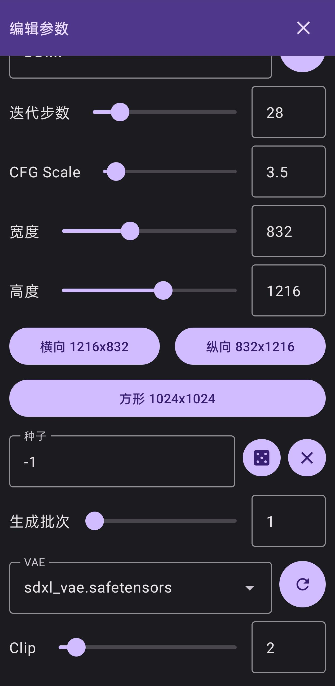
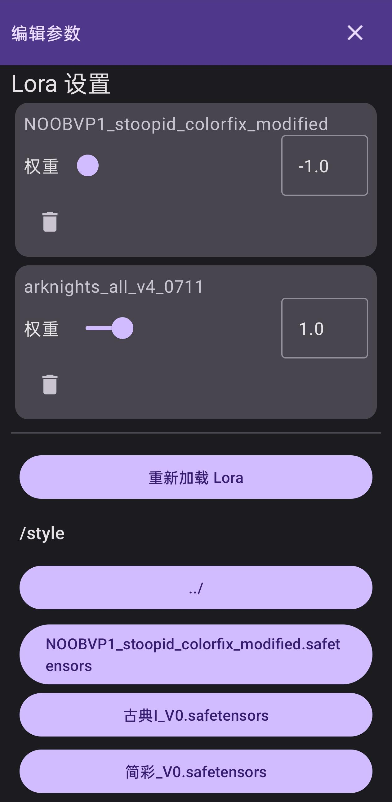

  
  <h2 align="center">Stable Diffusion Android Client</h2>
  
安卓端 Stable Diffusion 控制器，连接并远程操作 AUTOMATIC1111 WebUI

  
  
  

  

    <a href="./README.md">English</a>
    ·
    <a href="./README.zh-CN.md">简体中文</a>
  

## 概述

一个独立的 Android 客户端，可通过 API 与 [AUTOMATIC1111/stable-diffusion-webui](https://github.com/AUTOMATIC1111/stable-diffusion-webui) 通信。

请确保在启动 WebUI 时添加 `--listen --api` 参数。

#### 功能特性

- [x] 自动保存生成参数等数据，无需每次重新输入
- [x] 多语言界面：
  - [x] English - 英文
  - [x] 简体中文 - 简体中文
  - [x] 繁體中文（台灣）- 繁体中文（台湾）
  - [x] 繁體中文（香港）- 繁体中文（香港）
  - [x] 日本語 - 日文
  - [x] 한국어 - 韩文
- [ ] 图生图模式支持
- [ ] ControlNet 支持
- [ ] 明亮主题配色修复
- [ ] 配置文件导入导出
- [ ] 新建/编辑提示词预设
- [ ] 生成结果一键分享
- [ ] 参数预设管理（保存多个配置并切换）
- [ ] 设置面板
  - [ ] 自动保存生成结果
  - [ ] 语言
  - [ ] 明亮/黑暗模式切换

💬 欢迎提交 Issue 或 Pull Request！

### 软件截图

